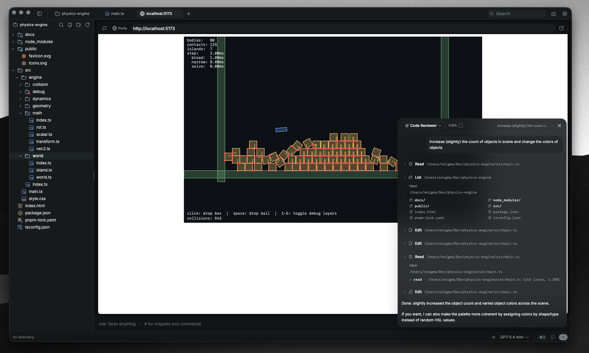

<div align="center">
  
  <h1>Cipher</h1>

  <p><strong>Open-source lightweight cross-platform AI-native terminal (ADE)</strong></p>

  <p>
    
    
    
  </p>
</div>

---

Cipher is a fast, lightweight AI terminal (ADE) built on Tauri 2 + Rust and React 19. It pairs a native PTY backend with a modern UI — multi-tab terminals, an integrated code editor, a file explorer, and a first-class **Gemini-First** AI engine.

## 🚀 Key Features

- **Time Travel Debugging**: Atomic state snapshots (zstd compressed) allow you to scrub through your project's history and revert accidental AI edits instantly.
- **Project Context Engine (RAG)**: A native Rust-based indexing system (SQLite FTS5) that semantically injects relevant file context into every AI interaction.
- **Ghost Text Autocomplete**: Ultra-low latency, inline code suggestions powered by Gemini Flash and your local project context.
- **Native-First Architecture**: High-performance Rust modules for filesystem, auth, and data management, keeping memory usage < 100MB on M1 8GB.

## 🔐 Security & Auth

- **Zero API Keys**: Cipher uses **Google OAuth 2.0 (PKCE)**. No static keys are ever stored on disk or in `.env`.
- **Native Keychain**: All access and refresh tokens are stored strictly in your system's secure **OS Keychain** via the `keyring` crate.

## 📂 Architecture

Cipher follows a strict **Domain-Driven Design (DDD)** and **Native-First** approach. For more details on our architectural principles, see [CONTRIBUTING.md](CONTRIBUTING.md).

## Screenshots

<table>
  <tr>
    <td align="center"><br/><sub>Multi-tab terminal with WebGL rendering</sub></td>
    <td align="center"><br/><sub>Web preview of local dev servers</sub></td>
  </tr>
  <tr>
    <td colspan="2" align="center"><br/><sub>AI agentic workflow with project-scoped SQLite history</sub></td>
  </tr>
</table>

## Build from source

**Prerequisites**
- Rust (stable) — https://rustup.rs
- [Bun](https://bun.sh)
- Platform-specific Tauri prerequisites — https://tauri.app/start/prerequisites/

**Run**
```bash
bun install
bun run tauri dev          # development
bun run tauri build        # production bundle
```

**Checks**
```bash
bun run typecheck          # frontend type-check
cd src-tauri && cargo check # Rust backend check
```

## Tech stack

Tauri 2 · Rust · `portable-pty` · `rusqlite` · `zstd` · Bun · React 19 · TypeScript · xterm.js · CodeMirror 6 · Google GenAI SDK · Tailwind v4 · shadcn/ui · Zustand

## License

Cipher is licensed under the Apache-2.0 License. See [LICENSE](LICENSE) for more information.
